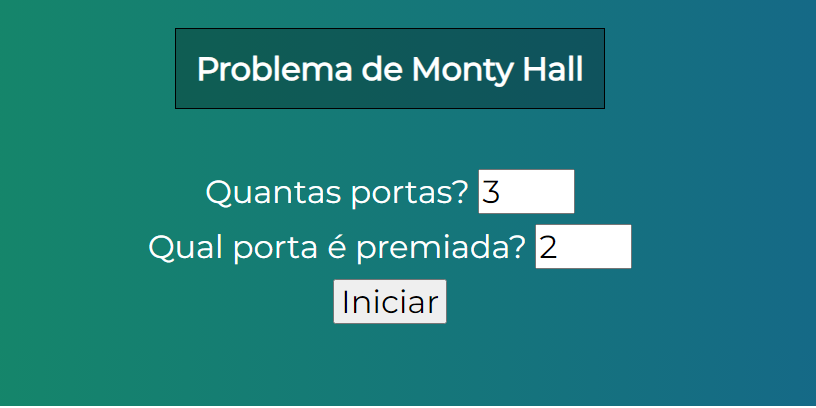
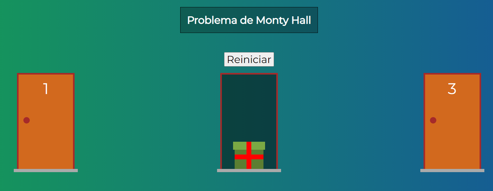

# MONTY HALL

# Sobre o projeto

Aplicação desenvolvida em VueJS para demonstrar o problema de Monty Hall. Produzido durante o curso Web-Moderno da Cod3r.

### Explicação

O problema é simples. Você está em um jogo em um programa de TV, e precisa escolher uma entre três portas: por trás de uma está um carro, e nas duas outras, cabras. Você escolhe um delas – digamos, a número 1 – e o apresentador (que sabe o que está por trás de cada uma delas) abre outra porta – digamos a número 3 – que tem uma cabra por trás. Você então tem a opção de continuar com a que escolheu, ou mudar para a outra – a número 2, no nosso exemplo.

A questão é: você deve mudar a sua escolha? A resposta é ao mesmo tempo incrivelmente simples e diabolicamente contraditória: a melhor estratégia é mudar de porta.

Quando você escolhe a primeira porta, a probabilidade de ganhar o carro por ela é de 1/3. As outras duas, em conjunto, tem 2/3 de probabilidade de conter o carro. Quando a porta com a cabra é aberta e eliminada, você fica com duas opções: uma com 1/3 de ter o carro, e outra com 2/3. Portanto, mudar de porta é sempre a melhor opção, e a sua chance de ganhar dobra de 1/3 para 2/3. Não significa que você ganhará o carro com certeza ao trocar de porta. Mas, se jogar diversas vezes e sempre escolher por trocar de porta, suas chances de ficar com o prêmio são bem maiores do que quando você mantém a primeira porta escolhida.

Trecho retirado do site: https://gizmodo.uol.com.br/paradoxo-monty-hall/

## Imagens da aplicação

### menu



### jogo



# 🚀 Começando

Essas instruções permitirão que você obtenha uma cópia do projeto em operação na sua máquina local para fins de desenvolvimento e teste.

## 📋 Pré-requisitos

- npm / yarn

## 🔧 Instalação
### :warning::warning: **A pasta img-montyhall**: é para guardar as imagens usadas no readme.md! Apagar ela depois do clone :warning::warning:
``` bash
### clonar repositório
git clone https://github.com/PauloCSantos/montyhall-vue.git

## entrar na pasta do projeto
cd montyhall

## instalar as dependencias
npm install

## executar o projeto
npm run serve
```

## 🛠️ Construído com

- HTML / CSS  
- VueJS

## ✒️ Autor

* **Paulo C Santos** - [Linkedin](https://www.linkedin.com/in/paulocsantos1995/)

## 🖐️ Agradecimento

Agradeço a equipe Cod3r e ao professor Leonardo pelo maravilhoso curso de Web-Moderno 

-Link do curso: https://www.udemy.com/course/curso-web/
